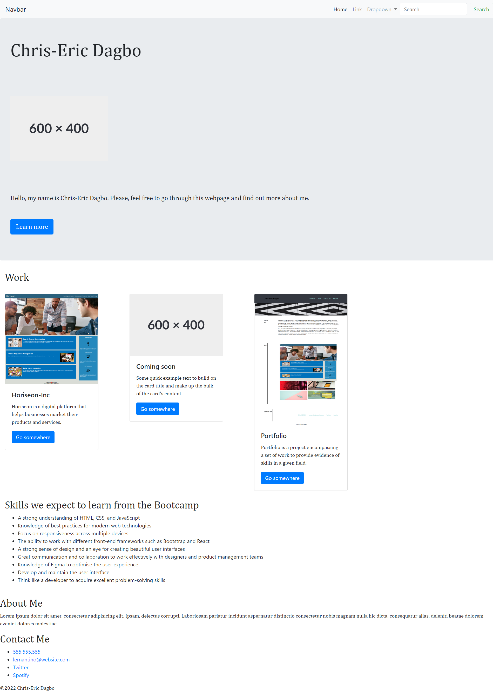

# Bootstrap-Portfolio

## Description
Bootstrap - Portfolio is a project implemented to test our ability to rely on Bootstrap to create a website.

## Table of contents
<ul>
    <li>Screenshot</li>
    <li>User Story</li>
    <li>Acceptance Criteria</li>
    <li>Technologies</li>
    <li>Installation</li>
    <li>Usage</li>
    <li>Contributors</li>
    <li>Documentation</li>
    <li>Licence</li>
    <li>Author</li>
</ul>

## Screenshot

## User Story
As an employer I want to view a potential employee's deployed portfolio seeting out his skills. It would allow us to assess your ability to use Bootstrap to create a website.

## Acceptance Criteria
Here are the critical requirements to develop a portfolio that statisfies a typical manager's needs:
<ul>
    <li>When the page is loaded, it presents a Jumbotron featuring your name, your picture, and links to sections about you, your work and how to contact you</li>
    <li>Use of Bootstrap to optimise the user experience</li>
    <li>Having an active and healthy commit history on GitHub</li>
    <li>Use of Bootstrap-cards to present your projects and add a brief description </li>
</ul>

## Technologies
We used the following technologies:
<ul>
    <li>HTML 5</li>
    <li>CSS 3</li>
    <li>Bootstrap 4</li>
</ul>

## Installation
The given project does not require any installation.

## Usage
Please refer to the deployment section.

## Contributors
We addressed some features of Bootstrap with our team members.
Here are their names:
<ul>
    <li>Ricky Bryans</li<>
    <li>Vittoria Bugana</li>
<ul>

## Documentation 
<ul>
    <li>https://getbootstrap.com/4.0/getting-started/introduction/</li>
    <li>https://developer.mozilla.org/us/</li>
    <li>https://www.w3schools.com</li>
</ul>

## License

Licensed under MIT License
Copyright (c) 2022 cedagbo

## Deployment
<ul>
    <li>Website: https://cedagbo.github.io/ </li>
    <li>Repository: https://github.com/cedagbo/Bootstrap-Portfolio</li>
</ul>

## Author
@cedagbo
    
